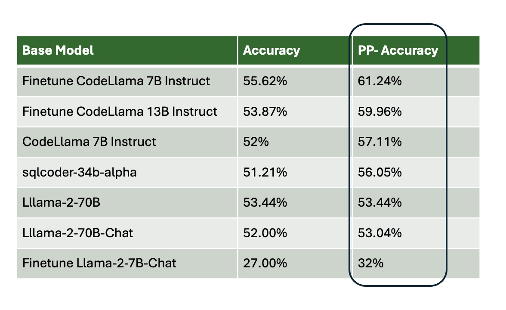
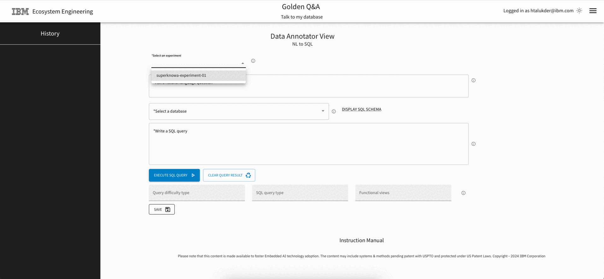
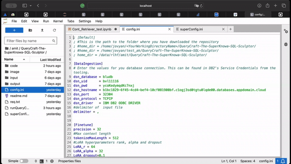
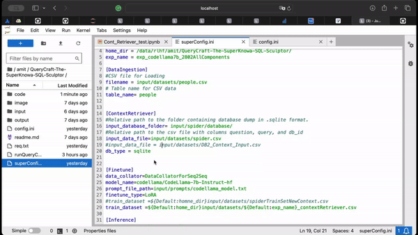
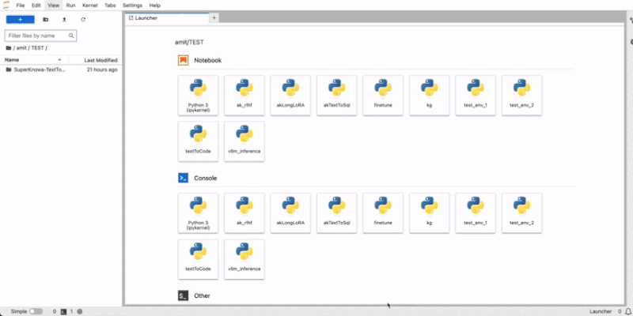
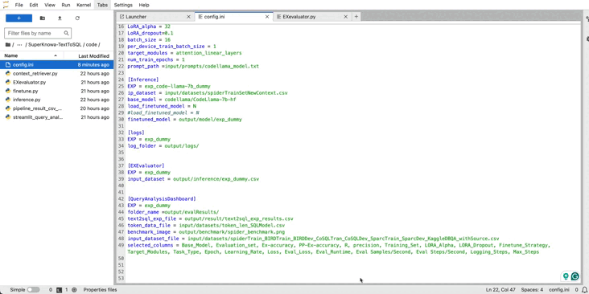

# QueryCraft (by SuperKnowa)

Welcome to the `SuperKnowa-QueryCraft` repository, your comprehensive solution for fine-tuning Large Language Models (LLMs) for the task of generating SQL queries from natural language. This module is designed to streamline the process of adapting LLMs for Text2SQL tasks, providing a robust framework and pipeline that accelerates the initiation and fine-tuning process. Whether you're a developer or a user keen on harnessing the power of LLMs for database querying, `SuperKnowa-QueryCraft` offers the tools and infrastructure to make your journey smoother and more efficient.

You need the following to run the QueryCraft pipeline:
- Database to run SQL query on and to evaluate the generated queries
- Instruct set for fine tuning (you can curate instruct it with Annotation tool)
  
---
## Why to use?
- Use QueryCraft to query relational databases using natural language questions instead of writing complex SQL queries
- Use QueryCraft to build a configurable TextToSQL pipeline on your Database
- Use QueryCraft to to evaluate the Text To SQL pipeline on your Database
- Use QueryCraft to to correct the LLM-generated queries
- Use QueryCraft to to fine-tune an LLM for SQL query generation on your database
- Use QueryCraft to to speed up inferencing for SQL query generation
- Use QueryCraft to to analyze the generated queries on a dashboard

---
## Benchmark Results 

We conducted various experiments on the Spider development dataset using different pre-trained and fine-tuned language model (LLM) architectures. Below are the highest results achieved with their respective LLMs. The highest result, <strong>70.57%</strong>, was obtained with the DB-Chat SQL model, compared to <strong>69% </strong>achieved by the Granite 20B code instruction-based model.


#### Outcomes:
1. Enhanced outcomes are evident with the query correction service, as demonstrated by its post-processing accuracy.
2. Smaller fine-tuned models outperforms some larger ones pretrained models.




## Features/Modules in QueryCraft
The QueryCraft pipeline is built of 8 modules/components.

1. **Instruct dataset curation**: This is a UI tool to curate instruct dataset for finetuning or evaluation of TextToSQL task. Read details about this module on our blog on [Golden dataset curation for text2sql](https://medium.com/@himadricuet/138f2e77847e).

    

2. **Data ingestion**: Data ingestion module can be used for ingesting your data to Db2 on IBM Cloud.

    

3. **Context Retriever**: Context retriever can be used to extract context from the instruct dataset given the instruct dataset. Read details about this module on our blog on [Diving Deep into Context Retrieval Techniques](https://medium.com/@sahil_desai/07b5f4b51273)

    


4. **Finetune**: Finetune service can be used for PEFT (Parameter Efficient Fine Tuning) for Text To SQL task. Read details about this module on our blog on [Text-to-SQL: A Deep Dive into Fine-Tuning Strategies](https://medium.com/@ak16425/59e2185b4b74)

    


5. **Inference**:
Inference service can be used to generate SQL queries either using a fine-tuned model or a pre-trained model on your NL-SQL pairs dataset. Read details about this module on our blog on [LLM inference text2sql](https://medium.com/@himadricuet/317a660de678)

    

6. **Query Correction**:
Inference service can be used to fix incorrect queries generated by LLM.


Read details about this module on our blog on [Improving Text-To-SQL Accuracy with Query Correction Service](https://medium.com/@abhilashamangal/614cd395a85b)


7. **Evaluation**:
Evaluation service consists of two modules - Query correction and Execution evaluation. Read details about our Evaluation framework on our blog [Text To SQL Evaluation Framework](https://medium.com/@Shivam_Solanki/8c5f461e7b05). Execution evaluation service can be used to calculate the execution accuracy on your database. Read details about our Evaluation framework on our blog [Text To SQL Execution Accuracy](https://medium.com/@Shivam_Solanki/5d7ab8398232)

    


8. **Query Analysis dashboard**
Query Analysis dashboard service can be used to analyze the results of generated queries and compare output of multiple LLMs. Read details about our Evaluation framework on our blog [Exploring LLM performance in Text-To-SQL generation with Query Analysis Dashboard](https://medium.com/@abhilashamangal/ccd547a020fd)

    

## Getting Started

To get started with `SuperKnowa-QueryCraft`, clone this repository to your local machine:

```bash
git clone https://github.com/ibm-ecosystem-engineering/SuperKnowa-QueryCraft.git
cd SuperKnowa-QueryCraft
```

### Installation

Before diving into fine-tuning or inference, ensure that your environment is set up with all the necessary dependencies:

```bash
pip install -r requirements.txt
```

### Configuration Files
Configure your environment and services by editing the  `simpleConfig.ini` and `expertConfig.ini` files. You have two options of configuring the QueryCraft pipeline
- simpleConfig: Use this to specify the paths for datasets, models, and other services as per your setup.
- expertConfig: Use this to configure the parameters of your experiment including fine-tuning.


`SuperKnowa-QueryCraft` provides the capability to run the whole pipeline (Context Retriever -> Fine-tuning -> Inference -> Query Correction -> Evaluation -> Query Analysis dashboard) together and also you can run each component individually. 

## Step by Step instructions
You need a GPU environment for running and fine-tuning LLM using QueryCraft framework. Read [Setting up environment](/document/Setting%20up%20environment.md) for more details.
Please read the [detailed documentation](/document/) for step by step instructions

## Step 0. Instruct dataset

There are three options for using your dataset to finetune/evaluate the Text to SQL (QueryCraft) pipeline:

1. Bring your dataset with golden queries in the following format: question, query, and db_id. Instruction for ingesting the dataset is provided in the next Step 1.
1. Curate the golden query dataset using our annotation tool: <https://annotator.superknowa.tsglwatson.buildlab.cloud/>
1. Use the example datasets provided below for testing: Spider and KaggleDBQA

Please read the [Step 0. Golden Query Dataset Annotation](/document/Step%200.%20Golden%20Query%20Dataset%20Annotation.md) for step by step instructions for the Instruct dataset.

## Step 1. Data Ingestion 
You have 3 options for Data Ingestion.
1. Bring Your Own Data
  - If you have both databases and instruct set (golden query)
  - If you only have database and not instruct set then use above annotation tool 
2. Use the example set
  - This comes with both source dataset and Instruct Db

Please read the [Step 1. Data Ingestion](/document/Step%201.%20Data%20Ingestion.md) for step by step instructions for the Instruct dataset.

Run the Data Ingestion module of the QueryCraft pipeline using the `runQueryCraft.sh`, file with the `dataIngestion` option after setting the `simpleConfig.ini` file to insert `salary.csv` into the a table in db2.  

```bash
sh runQueryCraft.sh
```
Provide the option:
```bash
dataIngestion
```

## Step 2. Context Retriever

Please read the [Step 2. Context Retriever](/document/Step%202.%20Context%20Retriever.md) for step by step instructions for the Instruct dataset.

Execute the context retriever using the following command. 

```bash
sh runQueryCraft.sh
```

Provide the option:

```bash
contextRetriever
```

## Step 3. Fine-Tuning

Please read the [Step 3. Finetuning](/document/Step%203.%20Finetuning.md) for step by step instructions for the Instruct dataset.

To start fine-tuning your LLM for the Text to SQL task, run the below command.

```bash
sh runQueryCraft.sh
```
Provide the option:
```bash
finetune
```

Follow the prompts to specify your dataset and model configuration.

## Step 4. Inference

Please read the [Step 4. Inference](/document/Step%204.%20Inference.md) for step by step instructions for the Instruct dataset.

To generate SQL queries using your fine-tuned or pre-trained model, execute:

```bash
sh runQueryCraft.sh
```
Provide the option:
```bash
inference
```

## Step 5. Query Correction

Please read the [Step 5. Query Correction](/document/Step%205.%20Query%20Correction.md) for step by step instructions for the Instruct dataset.

```bash
sh runQueryCraft.sh
```
Provide the option:
```bash
querycorrection
```

## Step 6. Evaluation

Please read the [Step 6. Evaluation](/document/Step%206.%20Evaluation.md) for step by step instructions for the Instruct dataset.

Evaluate the performance of your model against the SQLite database or DB2 by running the below command:

```bash
sh runQueryCraft.sh
```
Provide the option:
```bash
evaluation
```


## Step 7. Query Analysis Dashboard

Please read the [Step 7. Query Analysis](/document/Step%207.%20Query%20Analysis.md) for step by step instructions for the Instruct dataset.

For a visual analysis of your fine-tuning experiments and generated SQL queries, launch the streamlit dashboard:

```bash
sh runQueryCraft.sh
```
Provide the option:
```bash
queryanalysisDashboard
```

```bash
 cd code
 streamlit run streamlit_query_analysis_dashboard.py --server.port 8502 --server.fileWatcherType none
```


## Step 8. Run pipeline (all)
Please read the [Step 8. Run Full Pipeline](/document/Step%208.%20Run%20Full%20Pipeline.md) for step by step instructions for the Instruct dataset.

To run all components together, you can change the required parameters in `ssimpleConfig.ini`. You must set the default path as shown in the designated section below. 

```
[Finetune]
train_dataset =${Default:home_dir}input/datasets/${Default:exp_name}_contextRetriever.csv

[Inference]
input_dataset = input/datasets/${Default:exp_name}_validSet.csv


[QueryCorrection]
input_dataset = ${Default:home_dir}output/inference/${Default:exp_name}_inference.csv

[EXEvaluator]
input_dataset = ${Default:home_dir}output/inference/${Default:exp_name}_inference.csv
```

Run the below command:

```bash
sh runQueryCraft.sh
```

Provide the option:
```bash
all
```

## Build Lab Team 

Created & Architected By
- [Kunal Sawarkar](), Chief Data Scientist

Builders
- [Shivam Solanki](https://github.com/biharicoder)
- [Kevin Huang](https://github.com/kevinxhuang)
- [Abhilasha Mangal](https://github.com/Abhilasha-Mangal)
- [Amit Khandelwal](https://github.com/ak16425)
- [Sahil Desai](https://github.com/sahil11129)
- [Himadri Talukder](https://github.com/hitalukder)

## License

This project is licensed under the Apache-2.0 license - see the [LICENSE](LICENSE) file for details. Copyright @ 2024 IBM Corporation.
