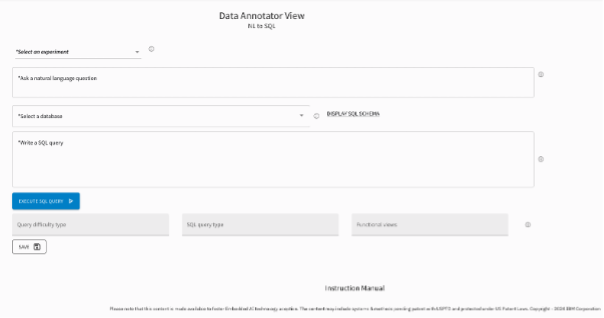
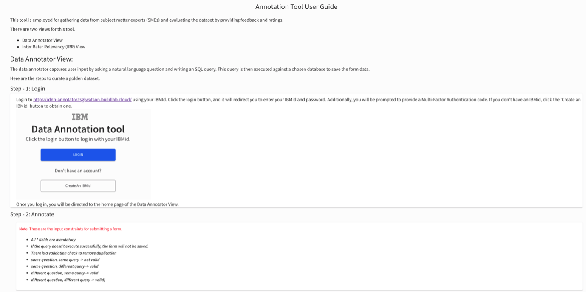
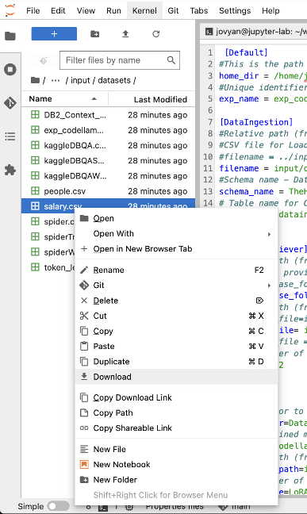
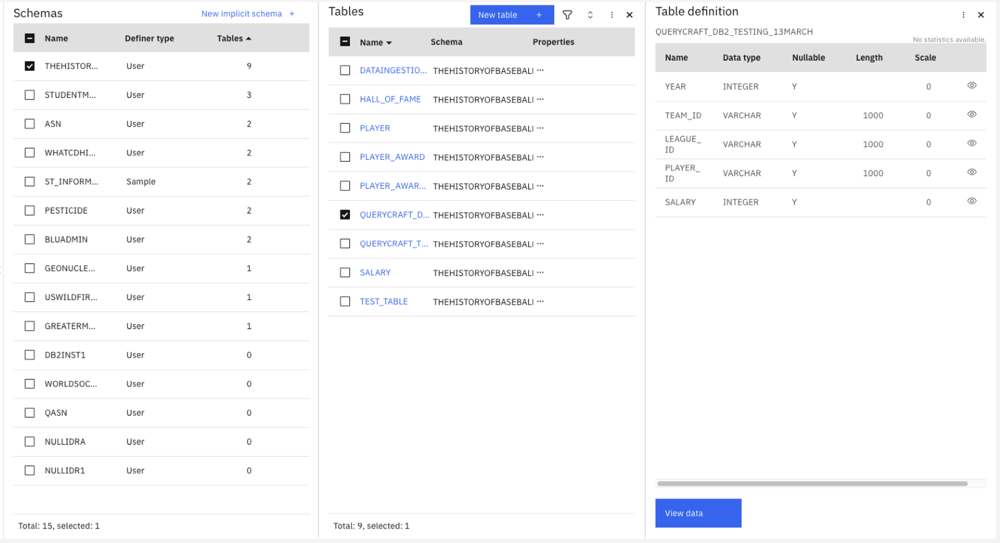
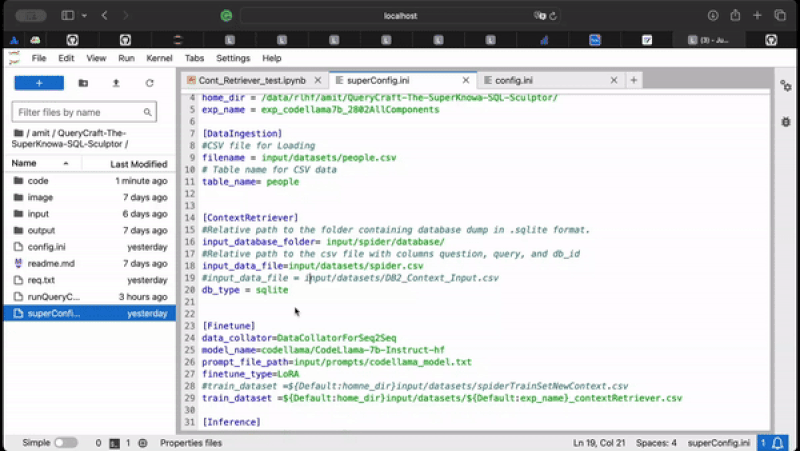

# QueryCraft-The-SuperKnowa-SQL-Sculptor

Welcome to the `QueryCraft-The-SuperKnowa-SQL-Sculptor` repository, your comprehensive solution for fine-tuning Large Language Models (LLMs) for the task of generating SQL queries from natural language. This module is designed to streamline the process of adapting LLMs for Text to SQL tasks, providing a robust framework and pipeline that accelerates the initiation and fine-tuning process. Whether you're a developer or a user keen on harnessing the power of LLMs for database querying, `SuperKnowa SQL Sculptor` offers the tools and infrastructure to make your journey smoother and more efficient.

## Features

- **superConfig.ini**: A super configuration file to manage basic level settings for data ingestion, context retriever, fine-tuning, inference, query-correction, evaluation, and the query analysis dashboard among other services.
- **config.ini**: A configuration file to manage all settings for data ingestion, context retriever, fine-tuning, inference, query-correction, evaluation, and the query analysis dashboard among other services.
- **db2_connector.py**: This script provides global IBM DB2 connection for all other services.
- **db2_ingestion.py**: This script is used to insert the data into DB2 from a CSV file or any other delimiter file.
- **context_retriever.py**: This script extracts context directly from the SQLite database to inform and improve the accuracy of generated queries.
- **finetune.py**: Fine-tune your LLM specifically for the text-to-SQL task, optimizing its performance for your unique requirements.
- **inference.py**: Run the inference pipeline using either a pre-trained or a fine-tuned model to generate SQL queries from natural language inputs.
- **query_correction.py**: A script dedicated to correcting the syntax of generated SQL queries.
- **ex_evaluator.py**: A script dedicated to calculating the execution accuracy of generated SQL queries against an SQLite database, ensuring that your fine-tuned model performs optimally.
- **pipeline_result_csv_gen.py**: Extracts details of fine-tuning experiments and saves them to a CSV file, facilitating in-depth analysis through the query analysis dashboard.
- **streamlit_query_analysis_dashboard.py**: A Streamlit application that provides a comprehensive dashboard for analyzing the results of your fine-tuned model and conducting comparative analyses.

## Input

This module uses various inputs to train, evaluate, and optimize the performance of your model:

- **datasets/**: Contains datasets used for fine-tuning and evaluation of the Text to SQL model.
- **prompts/**: A collection of prompts used across different models for generation and fine-tuning tasks.
- **spider/**: The Spider database, serves as a benchmarking tool for evaluating the performance of your Text to SQL tasks.

## Output

The output directories are structured to organize the results of the different services and experiments:

- **benchmark/**: Stores benchmark results for Text to SQL tasks, allowing for performance comparison.
- **evalResults/**: A folder dedicated to storing the results of the evaluation service.
- **inference/**: Contains the results of the inference service, showcasing the SQL queries generated by your model.
- **logs/**: Logs of the experiments are kept here for future reference and analysis.
- **model/**: A directory to store model checkpoints, facilitating easy retrieval and deployment of your fine-tuned models.
- **result/**: A folder dedicated to storing the results of logs to show the results at the Query analysis dashboard.

## Getting Started

To get started with `QueryCraft-The-SuperKnowa-SQL-Sculptor`, clone this repository to your local machine:

```bash
git clone https://github.com/ibm-ecosystem-engineering/QueryCraft-The-SuperKnowa-SQL-Sculptor.git
cd QueryCraft-The-SuperKnowa-SQL-Sculptor
```

### Installation

Before diving into fine-tuning or inference, ensure that your environment is set up with all the necessary dependencies:

```bash
pip install -r requirements.txt
```

### Configuration

Configure your environment and services by editing the  `superConfig.ini` and `config.ini` files. In superConfig specify the paths for datasets, models, and other services as per your setup. In `config.ini` you can change the more detailed parameters for experimentation.

`QueryCraft-The-SuperKnowa-SQL-Sculptor` provides the capability to run the whole pipeline (Context Retriever -> Fine-tuning -> Inference -> Query Correction -> Evaluation -> Query Analysis dashboard) together and also you can run each component individually. 

### Golden Query Annotation 
There are three options for using your dataset to `finetune/evaluate` the Text to SQL (QueryCraft) pipeline: 

1. Bring your dataset with golden queries in the following format: `question`, `query`, and `db_id` 
Instruction for ingesting the dataset is provided in the next Step 1. 
2. Curate the golden query dataset using our annotation tool: [https://dnb-annotator.tsglwatson.buildlab.cloud/] 
3. Use the example datasets provided below for testing: Spider and KaggleDBQA 
Unzip the example datasets using the command:

```
cd ./input 
unzip spider.zip 
unzip kaggleDBQA.zip 
cd ..
```

**Golden Query Annotation:**
1. Go to our annotation tool. [https://dnb-annotator.tsglwatson.buildlab.cloud/]


 
3. Click on the Instruction Manual and follow the instructions for curating the golden queries dataset. https://dnb-annotator.tsglwatson.buildlab.cloud/documentation 




### 1. Data Ingestion (skip if source data is in sqllite database)
You can ingest your delimited files to DB2 on IBM cloud. Once the data is properly ingested, you can run the QueryCraft pipeline on your data. 

**Prerequisites:**  
- ***Access to IBM Cloud.*** You can create a free account. [https://cloud.ibm.com/registration] 
- ***Access to a DB2 database.*** You can provision a free instance: [https://cloud.ibm.com/catalog/services/db2] 
- ***Service credentials for the DB2 database.*** Get the db2 credentials from the IBM cloud by following the steps here: [https://cloud.ibm.com/docs/Db2onCloud?topic=Db2onCloud-getting-started] 
 
The `db2_Ingestion` module offers a streamlined method for inserting data from CSV or any delimiter file into db2 to fine-tune text to SQL pipelines.  
 
First, set the following credentials in the `config.ini` file under the `[DB2_Credentials]` section: 
 
- ***dsn_database:*** Name of the database. 
- ***dsn_uid:*** User ID for the database. 
- ***dsn_pwd:*** Password for the database. 
- ***dsn_hostname:*** Hostname or IP address of the database server. 
- ***dsn_port:*** Port number of the database server. 
- ***dsn_protocol:*** Protocol used for communication. 
- ***dsn_driver:*** Driver used for database connection. 


1.   If you don’t have delimited files for your database containing the golden query dataset, you can use a file from the `/input/dataset folder` from the test env. 



2. Now specify the file path, including the file name, in the superConfig.ini file under the `[DataIngestion]` section. Additionally, indicate the table name that needs to be created in the db2 database. If you are using the salary.csv, TheHistoryofBaseball is the right schema. Ensuring the right schema is important as the Golden query dataset contains this information in the column `db_id`. This is required to run the context retriever and the execution evaluation service.

```
#Relative path (from home_dir) of csv file to be ingested in db2 table 
#CSV file for Loading 
#filename = ../input/datasets/people.csv 
filename = input/datasets/salary.csv 
#Schema name - Database 
schema_name = TheHistoryofBaseball 
# Table name for CSV data 
table_name= querycraft_db2_testing_13march
```

If the user needs to import a file specifying the delimiter for files other than CSV, the user can adjust the delimiter from the `config.ini` file: 

```
delimiter = , 
```

Run the Data Ingestion module of the QueryCraft pipeline using the runQueryCraft.sh, file with the dataIngestion option after setting the superConfig.ini file to insert `salary.csv` into the `querycraft_db2_testing_13march` table in db2.  

```bash
sh runQueryCraft.sh
```
Provide the option:
```bash
dataIngestion
```
You can validate the successful execution of the dataIngestion module from the DB2 UI as well. 



### 2. Context Retriever
To run the context retriever change the required parameters according to your db_type sqlite or db2 into `config.ini` file and run the below command.

```bash
sh runQueryCraft.sh
```
Provide the option:
```bash
contextRetriever
```


### 3. Fine-Tuning

To start fine-tuning your LLM for the Text to SQL task, run the below command.

```bash
sh runQueryCraft.sh
```
Provide the option:
```bash
finetune
```


Follow the prompts to specify your dataset and model configuration.

### 4. Inference

To generate SQL queries using your fine-tuned or pre-trained model, execute:

```bash
sh runQueryCraft.sh
```
Provide the option:
```bash
inference
```


### 5. Query Correction

```bash
sh runQueryCraft.sh
```
Provide the option:
```bash
querycorrection
```

### 6. Evaluation

Evaluate the performance of your model against the SQLite database or DB2 by running the below command:

```bash
sh runQueryCraft.sh
```
Provide the option:
```bash
evaluation
```


## 7. Query Analysis Dashboard

For a visual analysis of your fine-tuning experiments and generated SQL queries, launch the streamlit dashboard:

```bash
sh runQueryCraft.sh
```
Provide the option:
```bash
queryanalysisDashboard
```

```bash
 cd code
 streamlit run streamlit_query_analysis_dashboard.py --server.port 8502 --server.fileWatcherType none
```


## 8. Run pipeline (all)
To run all components together, you can change the required parameters in `superConfig.ini`. and run the below command:

```bash
sh runQueryCraft.sh
```

Provide the option:
```bash
all
```

To run the individual component you can follow the below steps:


## License

This project is licensed under the Apache-2.0 license - see the [LICENSE](LICENSE) file for details.
